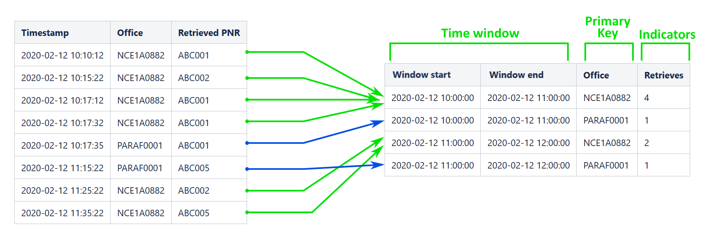
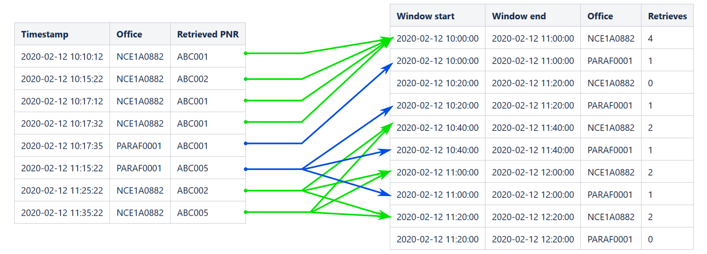
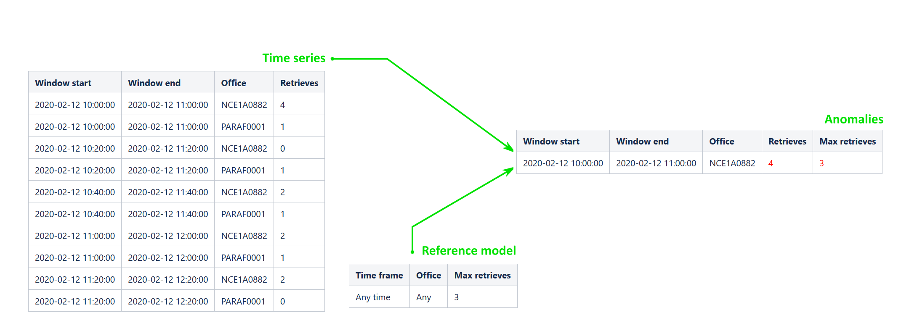
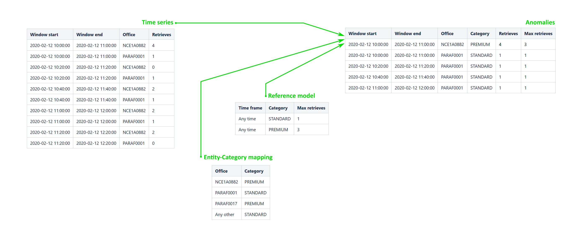
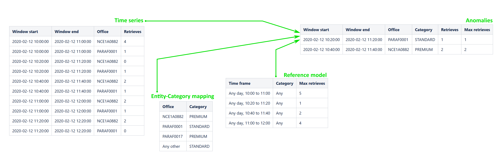

# Time Series Operations Library

## Functional overview

The goal of this library is to provide the core logic to apply time-series analysis to event logs for monitoring and alerting. 
From a set of homogeneous event logs, the library builds time series and detects anomalies based on the functional details 
provided by the library client.


### Basic concepts
#### Time series aggregation

In the scope of modeling the behaviour over time of a given entity, the goal of time series generation is to transform 
a set of raw event logs in the continuous time - logging the activity of the monitored entity at given timestamps - 
into a discrete sequence of aggregated indicators computed over set time windows.  

E.g., in case we want to monitor the activity of offices retrieving PNRs over time, choosing the office as monitored entity 
and the amount of retrieves as indicator, the time series aggregation on hourly time windows (not overlapping) would look like:




Time series aggregation parameters:

* **time window width**, the distance between window start and window end (e.g., 1 hour);
* **time window sliding interval**, the distance between the start of each produced time window; if the sliding interval 
is different than the window width, time windows are overlapping.
* **primary key**, the entity for which we want to model the behaviour (e.g., office)
* **indicators**, the measures that we want to aggregate for the monitored entity (e.g., retrieves count) based on information 
in the event logs.

Example of time series with overlapping windows (width: 1 hour, sliding interval: 20 minutes):




Notice that, in case of overlapping windows, the same event log contributes to multiple lines of the time series.

#### Time series analysis: anomaly detection

The goal of anomaly detection is to compare indicators in a time series (aggregation of the behaviour of monitored entities 
over time) against a reference model - that describes the expected behaviour of each entity - and identify the lines 
in the time series that do not match the reference model.

E.g., from the time series in the example 2, if the reference model stated that any office should not perform more than 
3 retrieves per hour, the anomaly detection logic would identify the occurrence (2020-02-12 10:00 to 11:00, NCE1A0882, 4) 
as anomalous.




The reference model can describe the expected behaviour on different levels of detail:

* categories: the monitored entity can be partitioned into categories, for each of which the model expectes the same behaviour. 
In this case, the mapping assigning to each entity its category is also an input for the detection logic.


   

* time window: the model can describe the expected behaviour as a cyclic function of time (i.e., with different values 
for each hour of a day, each day of the week, ...). This is expecially helpful when the model is the result of analysis 
on past data, computed as the aggregation of measured behaviour over a period of time. In this case, each line of the 
time series is normalized to the time scale of the reference model.


   

### Input data
#### Applicative event logs
The library has been developed working with event logs, where one log generates a well defined event (from which input data to the library is built).  The event logs contain information about accesses performed by well identified entities/agents to well identified data containers. In general the system generates one event log for each access.

All logs should contain:
* the exact timestamp of the access;
* the unique data container identifier (e.g., record locator, OPS ID, ...);
* the unique identifier of the entity accessing the data (e.g., LSS identifiers).

In the example of access to PNRs, the event log may look like:
```
{ timestamp: "2020-02-10T10:20:30", recordLocator: "ABC123", agentOfficeId: "NCE1A0950", agentSign: "0123AB", action: "RETRIEVE", accessRight: "ReadOnly" }
```

* timestamp: in the `timestamp` field;
* unique container identifier: `recordLocator`;
* unique agent/entity identifier: `agentOfficeId` + `agentSign`

Any dataset that contains a timestamp, a primary key, and a set of features similar to what is described here will work with the library.

#### Entity model

Monitored entities can be categorized (e.g., human/robotic, ...), so that alerts depend on categories. The library needs:
* mapping between known entity to its category
* expected behaviour (fixed thresholds) for each category

Example of category mapping:

| agent officeId | agent sign | category |
|---|---|---|
| NCE1A0CMT | 0001AA | ROBOTIC |
| NCE1A0TTK | 0001AA | ROBOTIC |
| ... | ... | ... |
| NCE1A0TTK | 0012WE | HUMAN |
(table 1)

From the mapping, the columns that identify the entity/agent represent the mapping "primary key".

Example of expected behaviour:

| category | maxAccessCount | 
| --- | --- |
| HUMAN | 10 |
| QA | 50 |
| ROBOTIC | 250 |
(table 2)

### Output data
#### Time series

The library aggregates the amount of events performed by entities on containers, on time frames of set size.

The parameters of the analysis are fully configurable:
* time frame width and sliding interval;
* entity and container identifiers;
* indicators to count (access/update/...).


E.g., in the case of PNR access, if we choose the following parameters:
* time frame width: 1 hour, sliding: 20 minutes;
* container identifiers: recordLocator;
* entity identifiers: agentOfficeId, agentSign
* indicators to count: access count

the resulting time series would look like:

| window start | window end | agentOfficeId | agentSign | accessCount |
| --- | --- | --- | --- | --- | 
| 2020-02-20T10:00 | 2020-02-20T11:00 | NCE1A0TKK | 0001AA | 12 |
| 2020-02-20T10:20 | 2020-02-20T11:20 | NCE1A0TKK | 0001AA | 1 |
| 2020-02-20T10:40 | 2020-02-20T11:40 | NCE1A0TKK | 0001AA | 2 |
| 2020-02-20T11:00 | 2020-02-20T12:00 | NCE1A0TKK | 0012WE | 50 |
| 2020-02-20T11:20 | 2020-02-20T12:20 | NCE1A0TKK | 0012WE | 5 |
| ... | ... | ... | ... | ... | ... |
| 2020-02-20T11:00 | 2020-02-20T12:00 | NCE1A0ABC | 0123WS | 2 |
| ... | ... | ... | ... | ... | ... |
(table 3)


#### Anomalies

The library analyzes the computed time series to detect anomalies based on the input model, producing alerts in the form 
of applicative events.

The parameters of the analysis are fully configurable:
* indicators to analyze (counters, ratios, ...);
* default category;
* the expected thresholds;
* time window normalization (check next paragraph);
* output alert format.

Continuing on the example of PNR access, using HUMAN as default category, the time series analysis would compare the lines 
in time series (table 3) against the mapping (table 1) and expected thresholds (table 2) and detect:
* NCE1A0TKK-0001AA is a ROBOTIC entity -> the allowed accessCount is 250 -> no anomaly
* NCE1A0TKK-0012WE is a HUMAN entity -> the allowed accessCount is 50 -> one anomaly
* NCE1A0ABC-0123WS is not in the mapping -> it is by default handled as HUMAN -> no anomaly

Additionally, if so specified in the client implementation, the library will map the fields from (table 1, 2, 3) to 
the alert format expected by the customer, for instance:

| alertTimestamp | retriever | retrieverCategory | accessCount | maxAccessCount | 
| --- | --- | --- | --- | ---|
| 2020/02/20 11:00AM | NCE1A0TKK/0012WE | Human | 50 | 10 |


#### Time window normalization

As long as the expected behaviour is defined as fixed thresholds, the same criteria for alerts apply to all lines of the 
time series in the same way.

In case the customer disposes of a more detailed model, based on a study of past data, the client will need to specify how
to "normalize" time window to the model. For instance, the cyclic model for PNRs access may be based on a daily cycle, looking 
like:

| window start | window end | category | maxAccessCount |
| --- | --- | --- | --- |
| 00:00 | 01:00 | HUMAN | 1 |
| 01:00 | 02:00 | HUMAN | 0 |
| 02:00 | 03:00 | HUMAN | 3 |
| ... | ... | ... | ... |
| 10:00 | 11:00 | HUMAN | 60 |
| 11:00 | 12:00 | HUMAN | 65 |
| ... | ... | ... | ... |
(table 4)

In this case, in order to compare the time series (table 3) against this cyclic model, the window normalizer will need to
transform time windows ignoring the information about the day; against this cyclic model, the occurrence of 
NCE1A0TKK/0012WE at 2020/02/20 11:00AM  would not be considered as an anomaly.


## Technical overview

### What the library contains

The library provides the two traits 

- AggregatorTrait - for the aggregation of time series from events
- AnalyzerTrait - for the detection of anomalies in time series

All configurable features are represented in the trait as fields and functions to override:

For AggregatorTrait:
* `AggregatorTrait.timestampColumn` : which column of the events contains the timestamp
* `AggregatorTrait.timeSeriesWindowDuration` : time frame width 
* `AggregatorTrait.timeSeriesSlideDuration` : time frame sliding interval
* `AggregatorTrait.primaryKey` : which columns contain the primary key for the aggregation (e.g., entity identifiers), 
i.e. what we want to analyze
* `AggregatorTrait.featureSelection` : relevant columns from the events (including the primary key)
* `AggregatorTrait.filteringCriteria` : filter events to process on a given condition (optionally)
* `AggregatorTrait.aggregation` : the indicators to monitor (e.g., accessCount, ...)

For AnalyzerTrait:
* `AnalyzerTrait.entityPrimaryKey` : the entity identifiers for the category mapping (table 1)
* `AnalyzerTrait.defaultCategory` : category to assign to entities by default
* `AnalyzerTrait.windowNormalizer` : how to compare time frames to the reference model (weekly, daily, flat thresholds, ...)
* `AnalyzerTrait.isAnomaly` : what condition defines an anomaly (e.g., accessCount > maxAccessCount)
* `AnalyzerTrait.translateAnomalySchema` : map the internal data representation to the expected alert format

Additionally, the abstract class `Aggregator` offers a simple implementation, able to read configuration details from 
typesafe.Config.


### What the library does not contain

The library is not a Spark job skeleton. It does not:
* read input from disk;
* write output time series and alerts to disk/kafka;
* handle deployment on Spark clusters;
* schedule executions.

### Dependencies

* Scala: 2.11.8
* Spark: 2.3.1 or 2.1.0

### Building the library

Adapt the dependency sources to your own, then `mvn package` will build the library jar:

* groupId: com.amadeus.tso
* artifactId: time-series-library

Choose the classifier matching your Spark version, either `scala211-spark23` or `scala211-spark21`.
Copy the resulting artifact to your local repository (the library is not available as a public artifact)

#### Maven

```
<dependency>
    <groupId>com.amadeus.tso</groupId>
    <artifactId>time-series-library</artifactId>
    <version>1.0.1</version>
    <classifier>scala211-spark23</classifier>
</dependency>
```

## Examples

Find an example of scenario and implementation in the [dedicated section](./src/test/README.md).

 